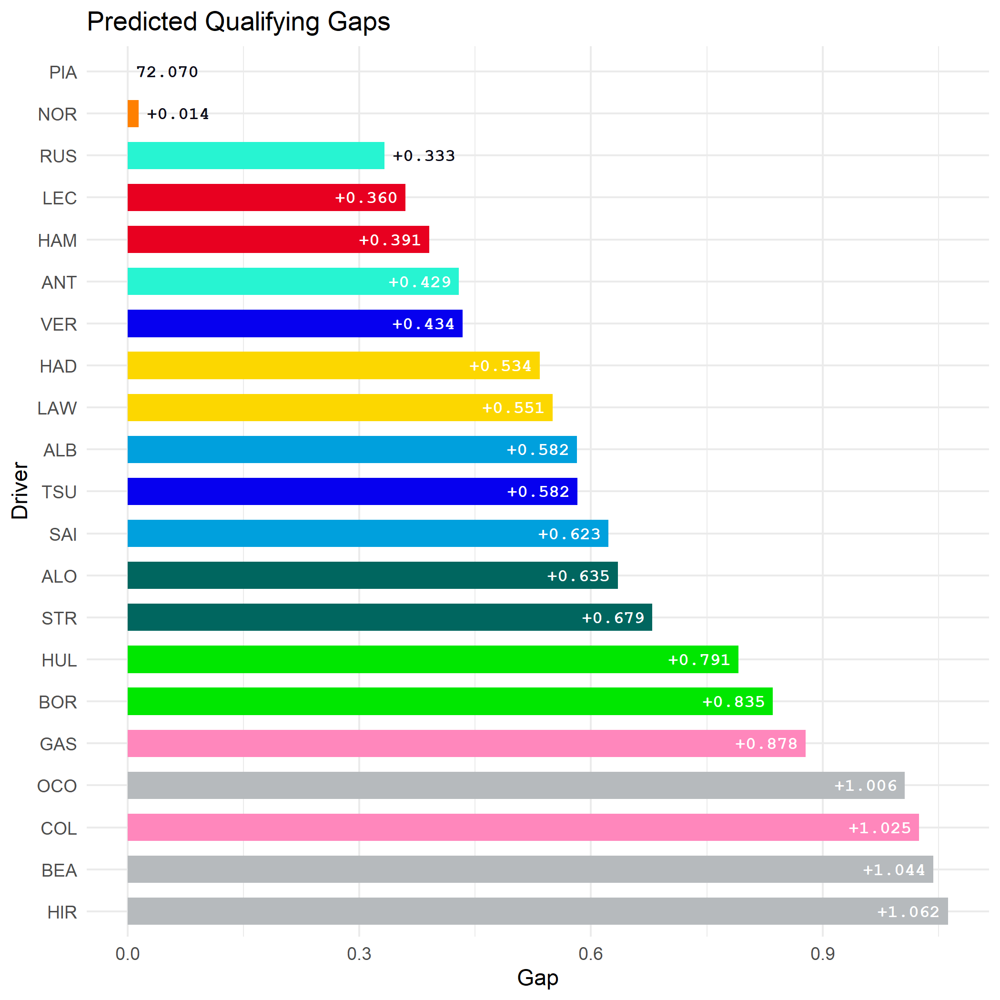

# laps-of-judgement
A Bayesian hierarchical model for predicting F1 qualifying performace using data fetched from [FastF1](https://github.com/theOehrly/Fast-F1).

## How it works
Uses free practice session lap times to generate a **probabilistic forecast of qualifying times** before qualifying.

### Key points
- Representative lap times are filtered for green flag running, stints on the softest compound, fresh tyres and under 4 laps of total stint length.
- The model accounts for track evolution across the elapsed session time term.
- Random intercepts are nested by constructor and driver, allowing the model to share statistical strength across the field, while still estimating individual driver pace offsets.
- The posterior predictive distribution over each driver's lap time is used to generate the quailfying gap forecasts.

## Getting started

### Clone the repository
```bash
git clone https://github.com/aes21/laps-of-judgement.git
cd laps-of-judgement
```

### Installation
Install Python and R environment dependencies.

```bash
python -m pip install -r .\requiremnts.txt
Rscript -e "renv::restore()"
```

### Fetch data
Example using 2025 season data.

```bash
python python/fetch_practice_data.py --year 2025
```

### Fit model for specific event
```bash
Rscript R/model.R "Spanish Grand Prix" 2025
```

### Generate a prediction
```bash
Rscript R/predict.R "Spanish Grand Prix" 2025
```
A plot of the qualifying gap prediction is generated in: `plots/` :



## Note
FastF1 only holds practice data beyond the 2018 season. Currently, `SOFT` is considered the qualifying tyre to align with the 2019 rule change. 
