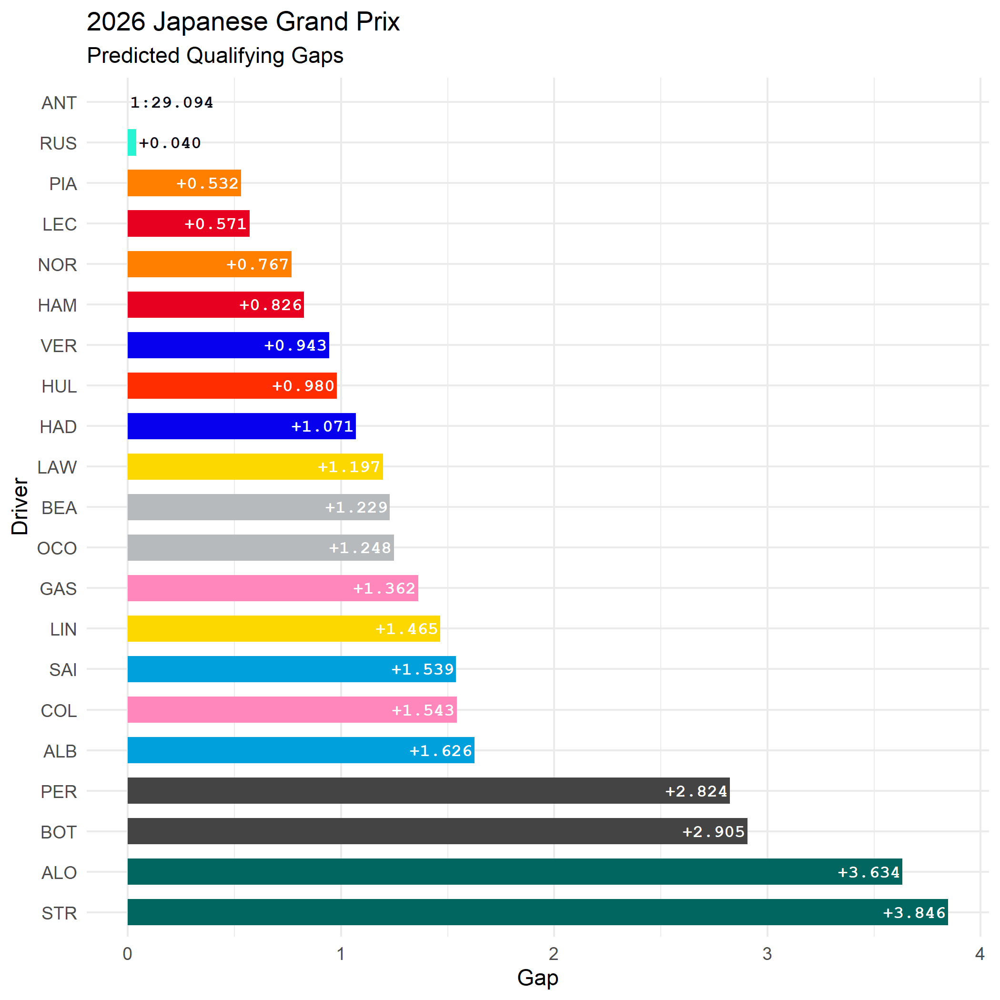
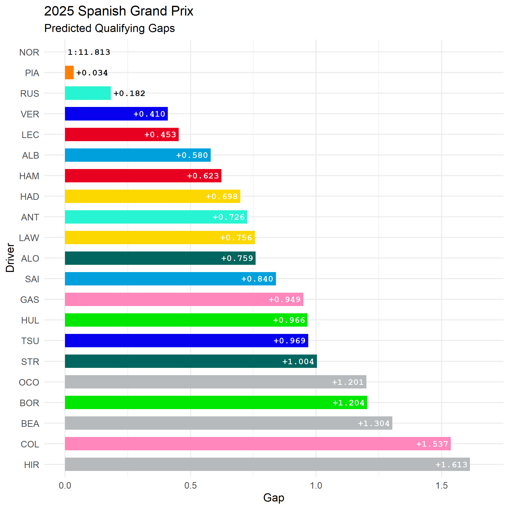
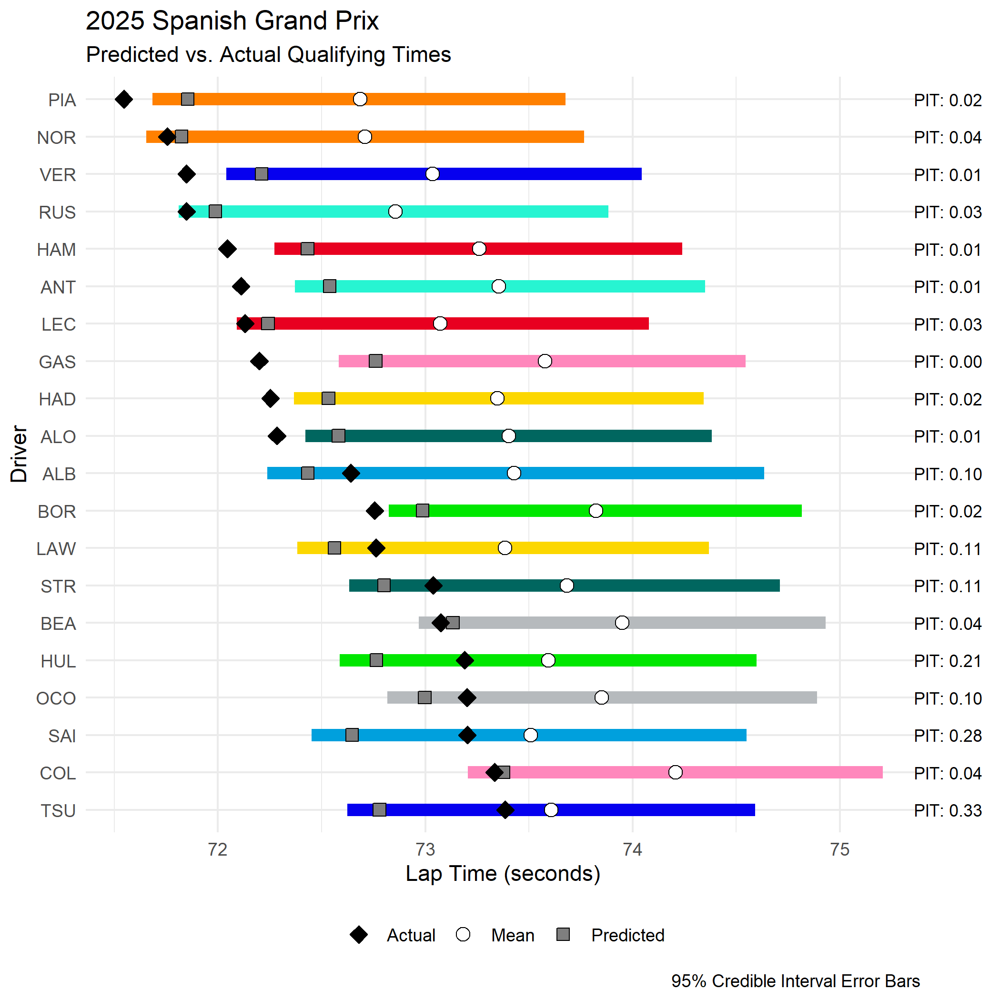

# laps-of-judgement
A Bayesian hierarchical model for predicting F1 qualifying performace.



## How it works
Uses free practice session lap time data fetched from [FastF1](https://github.com/theOehrly/Fast-F1) to generate a **probabilistic forecast of qualifying times** before qualifying.

### Key points
- Representative lap times are filtered for green flag running, stints on the softest compound, fresh tyres and under 4 laps of total stint length.
- The model accounts for track evolution across the elapsed session time term.
- Random intercepts are nested by constructor and driver, allowing the model to share statistical strength across the field, while still estimating individual driver pace offsets.
- The posterior predictive distribution over each driver's lap time is used to generate the quailfying gap forecasts.
- Low confidence predictions (i.e. not enough available data) are indicated by an asterisk.

## Getting started

### Clone the repository
```bash
git clone https://github.com/aes21/laps-of-judgement.git
cd laps-of-judgement
```

### Installation
Install Python and R environment dependencies.

```bash
python -m pip install -r .\requiremnts.txt
Rscript -e "renv::restore()"
```

### Fetch data
Example using 2025 season data.

```bash
python python/get_data.py --year 2025
```

You only need to run this line once for a given year, the subsequently created `data` directory will contain the cached data required to complete the rest of the workflow for any given event of that season.

> [!WARNING]
> FastF1 only holds practice data beyond the 2018 season. Currently, `SOFT` is considered the qualifying tyre to align with the 2019 rule change.

### Fit model for specific event
```bash
Rscript R/model.R "Spanish Grand Prix" 2025
```

### Generate a prediction
```bash
Rscript R/predict.R "Spanish Grand Prix" 2025
```

### Evaluate the prediction
For predicted sessions that have already been completed, the simulation can be evaluated against the known finishing results. You must retrieve the relevant season qualifying lap data before evalutating the model's predictions.

```bash
python python/get_data.py --session_type Q --year 2025
Rscript R/model.R "Spanish Grand Prix" 2025
Rscript R/predict.R "Spanish Grand Prix" 2025
```
A plot of the simulated qualifying gaps and prediction evaluations are generated in the `plots/` directory:

<table>
  <tr>
    <td></td>
    <td></td>
  </tr>
</table>

> [!NOTE]
> Drivers that participated in a practice session but not in qualifying (e.g., a reserve driver) are included in simulated predictions, but dropped in any evaluation of the models.