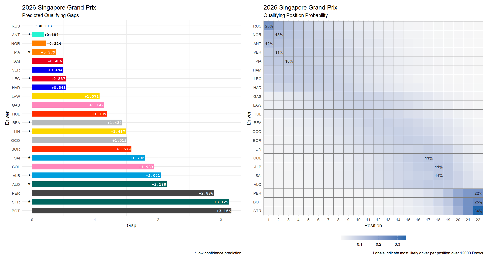
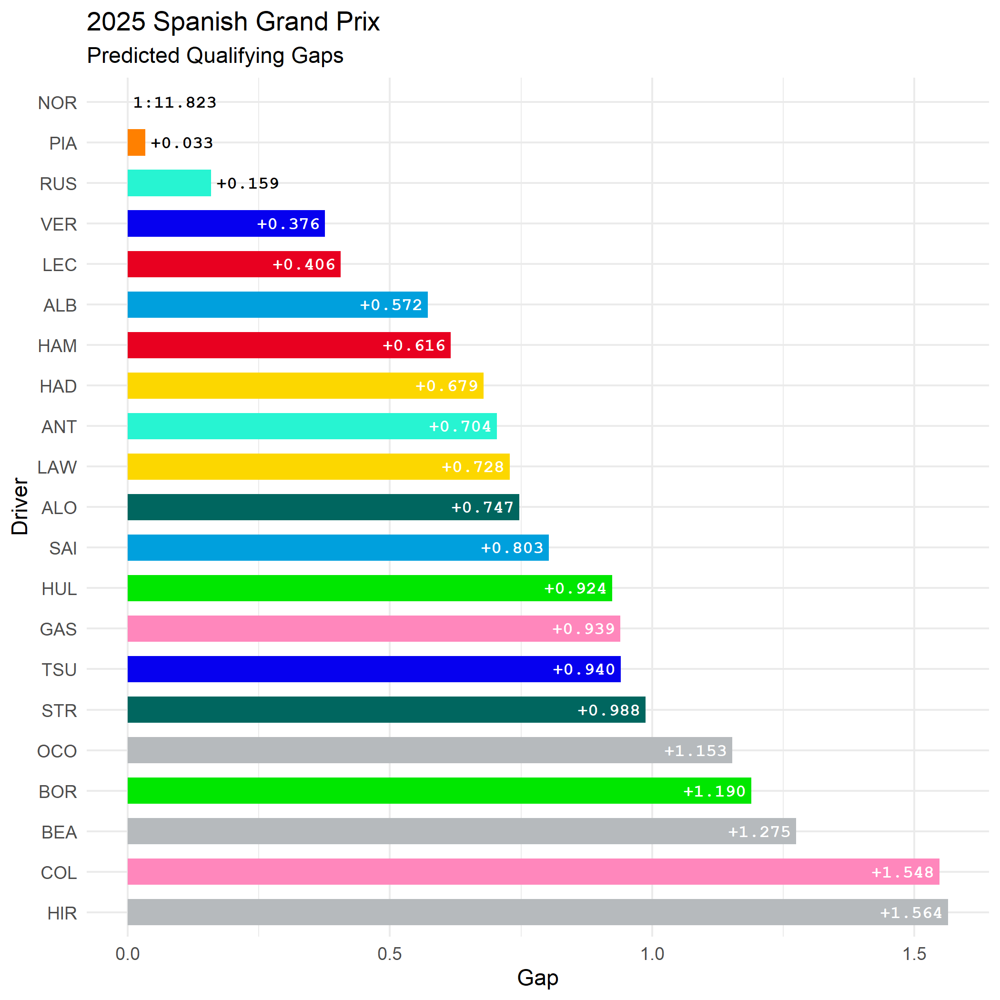
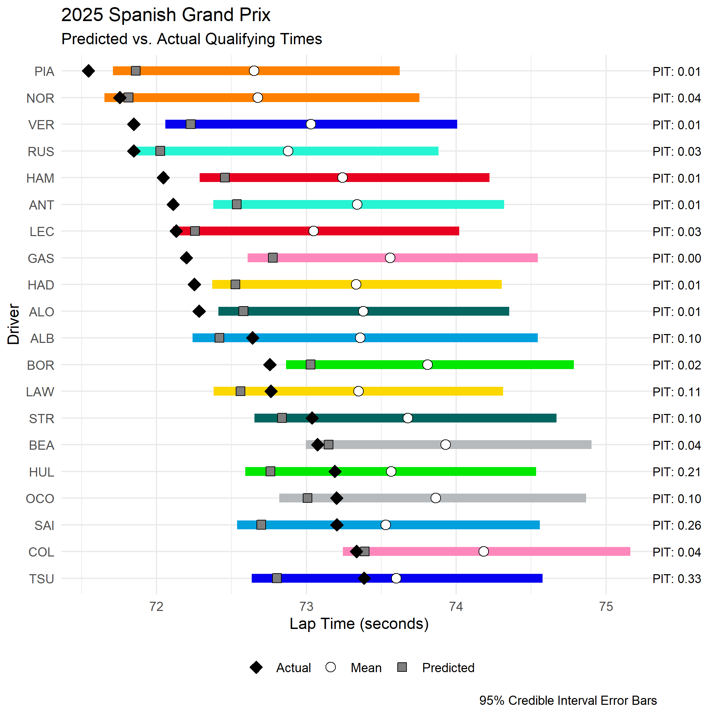

# laps-of-judgement
A Bayesian hierarchical model for predicting F1 qualifying performace. For evaluation of the current model, see the [scoring](docs/vignettes/scoring_model_vignette.md) vignette.



<details>
<summary>What do these predictions mean?</summary>

The bars display the gaps of drivers to the fastest predicted lap time (according to their individual 5th percentile of posterior simulations). Drivers marked with `*` had insufficient practice data to provide a high-confident prediction. The heatmap marks each driver's mostly likely position based on their probability across the posterior simulations.

</details>

## How it works
The approach uses filtered (see the [model](docs/vignettes/bayesian_model_vignette.md) vignette) free practice session lap time data fetched from [FastF1](https://github.com/theOehrly/Fast-F1) to generate a **probabilistic forecast of qualifying times** before qualifying.

## Getting started

### Prerequisites

Choose one of the following execution environments:

- **Docker** (recommended).
- **Local**: Python (3.14.3), R (4.52), and CmdStan.

### Clone the repository
```bash
git clone https://github.com/aes21/laps-of-judgement.git
cd laps-of-judgement
```

### Installation

**Docker:**

```bash
docker compose build
```

**Local:**

```bash
python -m pip install -r .\requirements.txt
Rscript -e "renv::restore()"
```

For local execution, ensure that the CmdStan toolchain is also installed.

### Fetch data
Example using 2025 season data.

> [!NOTE]
> To run the following workflow within Docker, prefix commands with `docker compose run --rm forecast`.

```bash
python python/get_data.py --year 2025 --session_type P

# build constructor offset from qualifying data
python python/get_data.py --year 2025 --session_type Q
```

You only need to run this line once for a given year, the subsequently created `data` directory will contain the cached data required to complete the rest of the workflow for any given event of that season.

> [!WARNING]
> FastF1 only holds practice data beyond the 2018 season. Currently, `SOFT` is considered the qualifying tyre to align with the 2019 rule change.

### Fit model for specific event
```bash
Rscript R/model.R "Spanish Grand Prix" 2025
```

### Generate a prediction
```bash
Rscript R/predict.R "Spanish Grand Prix" 2025
```

### Evaluate the prediction
For predicted sessions that have already been completed, the simulation can be evaluated against the known finishing results. You must retrieve the relevant season qualifying lap data before evalutating the model's predictions.

```bash
python python/get_data.py --session_type Q --year 2025
Rscript R/model.R "Spanish Grand Prix" 2025
Rscript R/predict.R "Spanish Grand Prix" 2025
```
A plot of the simulated qualifying gaps and prediction evaluations are generated in the `plots/` directory:

<table>
  <tr>
    <td></td>
    <td></td>
  </tr>
</table>

For a deeper discussion of the methods used, and evaluation of the model's effectiveness, see the [documentation](docs/) directory.
