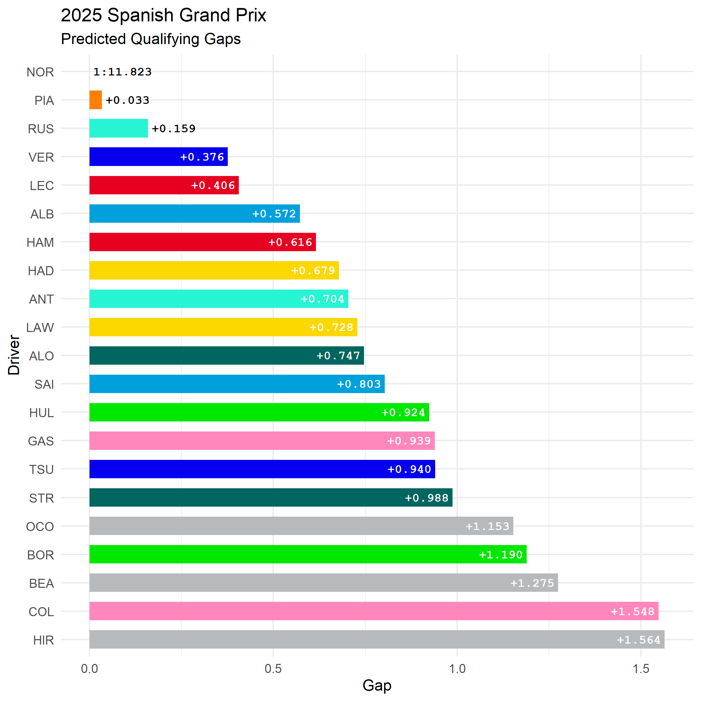
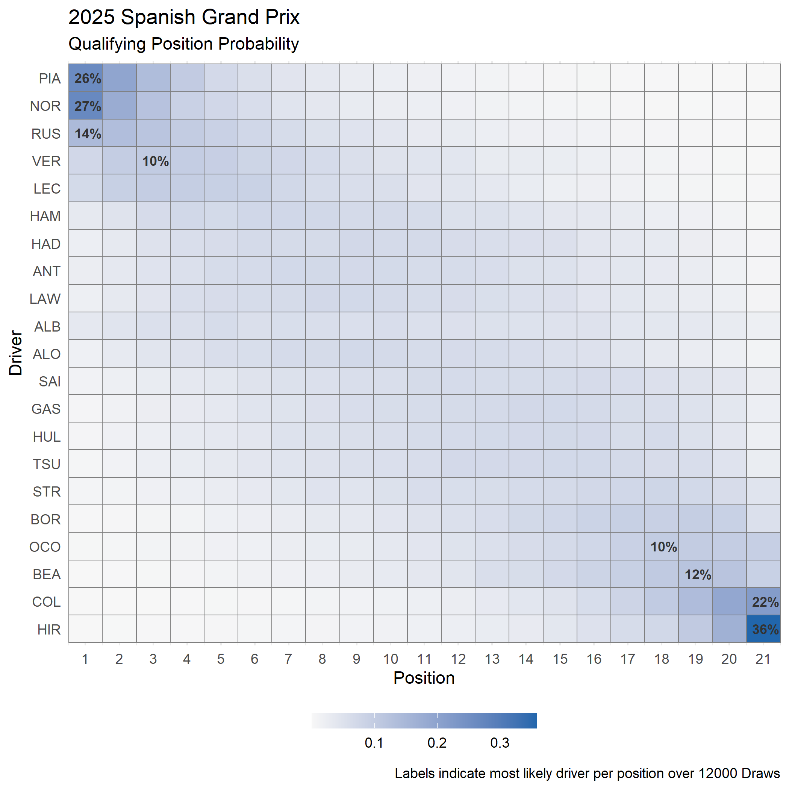
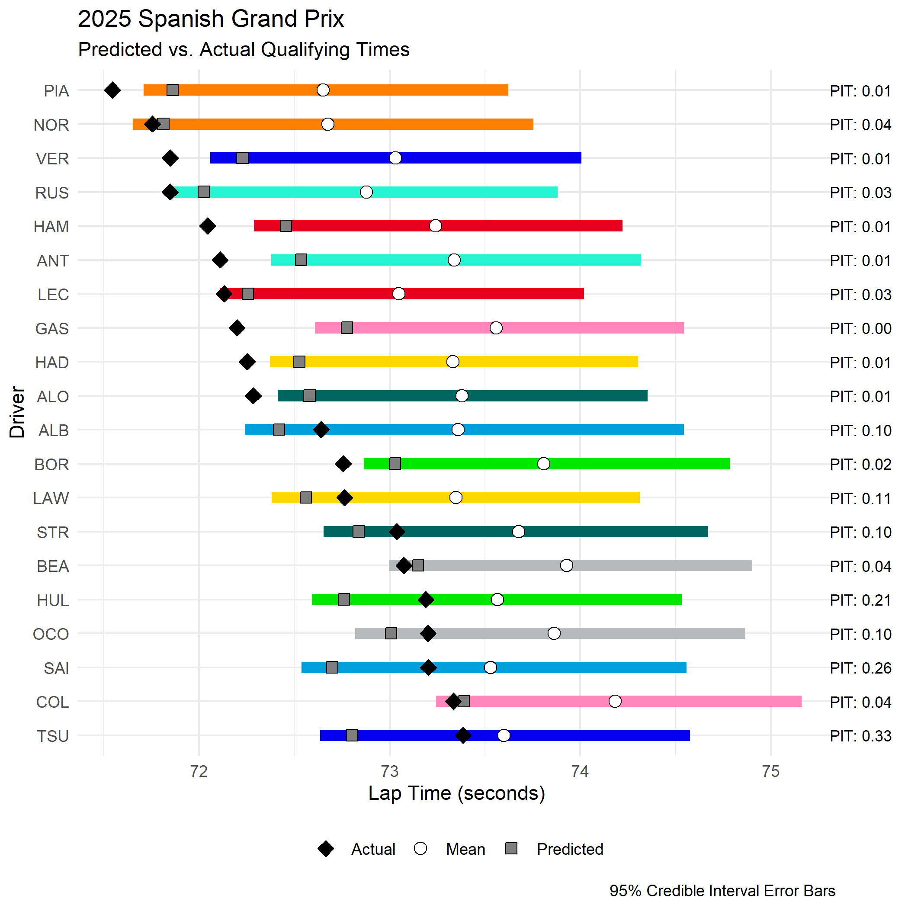

# Probabilistic Qualifying Forecasts in F1: A Bayesian Hierarchical Approach

`aes21/laps-of-judgement`

---

## Abstract

Bayesian hierarchical modelling provides a novel method of generating probabilistic forecasts of Formula 1 qualifying lap times from free practice session data. `laps-of-judgement` implements a complete pipeline - from raw lap times through to Bayesian inference via Markov Chain Monte Carlo (MCMC) - to produce driver-level posterior predictive distributions over qualifying times. Random intercepts nested by constructor and driver allow partial pooling of statistical strength across the field, while an elapsed-time covariate captures track evolution within a session. The resulting forecasts quantify uncertainty explicitly, yielding ranked qualifying gap distributions rather than single point estimates.

---

## Introduction

Generating accurate predictions of Formula 1 qualifying performance is a non-trivial statistical problem. The qualifying lap is a single, near-maximal effort shaped by a complex interaction of variables (e.g., track/tyre conditions). Traditional approaches to F1 qualifying predictions rely on point estimation: analysts select the fastest observed practice lap per driver and rank accordingly. This approach discards the distributional information inherent in the data, provides no principled measure of uncertainty, and is highly sensitive to single-lap outliers driven by traffic, yellow flags, or atypical runs. Furthermore, it offers no mechanism for sharing information across related drivers or teams, a key source of statistical strength when data is sparse.

This report describes the complete modelling pipeline for `laps-of-judgement`, from raw data collection and filtration, through model specification, inference, prediction, and evaluation.

## Methodology and Results

### Data Collection

```bash
python python/get_data.py --session_type P --year 2025
```

Practice data is retrieved from [FastF1](https://github.com/theOehrly/Fast-F1), limiting the use of `laps-of-judgement` to the 2018 season onwards. To prevent complicating the workflow, lap-by-lap data is pulled according to the defined session type subset for the entire season and cached in `raw/fastf1cache`. The lap times from each loaded session are labelled and concatenated to a master file, producing a single tidy data frame with one row per recorded practice lap across the season.

The collated master file is filtered for defined metrics that highlight specific qualifying runs, such as laps within a low stint length, on the softest available tyre compound, on fresh tyres, and recorded under green flag conditions. The objective is to isolate laps that are most representative of a driver's single-lap qualifying pace, discarding long-run fuel simulation stints, traffic-affected laps and out-/in-laps.

```r
#' Filters for qualifying run identification from practice runs.
#'
#' @param df A data.frame of session laps.
#' @param compound Qualifying tyre compound (defaults to 'SOFT').
#' @param max_stint Maximum stint length (defaults to '6').
#'
#' @return A filtered data.frame of session laps.
filter_qualifying_laps <- function(df, compound = "SOFT", max_stint = 6) {
  df |>
    group_by(.data$Driver, .data$Session, .data$Stint) |>
    mutate(StintLength = n()) |>
    ungroup() |>
    filter(
      .data$TrackStatus == 1,
      .data$IsAccurate == "True",
      .data$Compound == compound,
      .data$FreshTyre == "True",
    ) |>
    mutate(
      confidence = if_else(.data$StintLength <= max_stint, "", "*"),
      Driver = factor(.data$Driver),
      Team = factor(.data$Team)
    ) |>
    group_by(.data$Driver) |>
    filter(
      .data$StintLength <= max_stint |
        (!any(.data$StintLength <= max_stint) & 
           .data$StintLength == min(.data$StintLength))
    ) |>
    ungroup()
}
```

### Model Specification

The core statistical model is a Bayesian hierarchical linear regression implemented in R via the `brms` package with Stan as the backend:

```r
fit_quali <- brm(
  LapTime_sec ~ log(Weekend_Mins_Elapsed + 1) + Driver + (1 | Team),
  data = model_data_q,
  family = gaussian(),
  prior = c(
    prior_string(paste0("normal(", intercept_prior, ", 5)"), class = "Intercept"),
    prior(exponential(1), class = "sd"),
    prior(exponential(1), class = "sigma")
  ),
  chains = 4,
  iter = 4000,
  warmup = 1000,
  cores = detectCores()
)
```

**Fixed effects:** A `log(Weekend_Mins_Elapsed + 1)` term captures monotonic track evolution: as cumulative track time increases over the practice weekend, lap times fall as rubber is laid and the surface becomes more representative of qualifying conditions. Fixed intercepts per driver estimate individual pace offsets relative to the session mean.

**Random effects:** A random intercept `(1 | Team)` allows drivers within the same constructor to partially pool information, shrinking individual estimates towards the team average. This mitigates overfitting in cases where a driver has few representative laps available, while preserving inter-team differentiation.

**Priors:** The model intercept is centred at the median session lap time (`normal(intercept_prior, 5)`) providing an informative but weakly regularising prior that prevents the sampler wandering into physically impossible lap times. Standard deviation and residual error priors use `exponential(1)`, placing a mean of approximately one second on both the between-driver spread and the within-driver noise, which is a plausible loose prior for a modern Formula 1 circuit.

**Likelihood:** A Gaussian likelihood is adopted as a computationally efficient and robust baseline for push-lap data, which tends to cluster tightly around the driver mean. The authors note that future iterations could explore Log-Normal or Ex-Gaussian distributions to better capture the inherent right-skew of stochastic lap time data.

### Inference

Inference proceeds via Markov Chain Monte Carlo using the MCMC algorithms implemented in Stan, accessed through `cmdstanr`. Four parallel chains are run for 4000 iterations with a 1000-iteration warmup, producing 12,000 post-warmup posterior draws per parameter. Threading is enabled to parallelise within-chain computation across available CPU cores, substantially reducing wall-clock time for larger grids.

Convergence is assessed implicitly via the `brms` framework. The posterior distribution over each driver's lap time accounts jointly for uncertainty in the track evolution trend, individual pace offsets, team-level random effects, and residual lap-to-lap variability.

### Prediction

```bash
Rscript R/model.R "Spanish Grand Prix" 2025
Rscript R/predict.R "Spanish Grand Prix" 2025
```

Qualifying time forecasts are generated from the posterior predictive distribution. For each driver, the 5th percentile of their simulated lap time distribution is extracted as the point forecast. This attempts to approximate the optimal lap achievable by that driver under qualifying-representative conditions. The gap to the simulated pole time is then computed for each draw, yielding a distribution of predicted qualifying gaps per driver from which interval estimates can be reported.

Drivers with insufficient practice data to form a reliable posterior are flagged with an asterisk in the output, indicating low confidence in the prediction. The resulting forecast is saved to `plots/` as a visualisation of the simulated qualifying gap distributions.



As previously discussed, the 5th percentile is selected to extract a predicted qualifying time. The distribution of lap times across the simulated draws helps identify the probability of a driver landing a specific grid spot. As observed below, despite Norris (NOR) taking the pole in the point simulation, Piastri (PIA) is identified as having the quickest lap time in 25% of the simulated draws.



### Evaluation

For sessions that have already been completed, the model's predictions can be evaluated against the known qualifying results. Qualifying lap data for the relevant season must first be retrieved:



The evaluation compares the simulated qualifying gap distribution against the observed finishing order and lap time gaps. Drivers who participated in practice but did not start qualifying, such as reserve drivers, are excluded from the evaluation. Prediction accuracy and calibration plots are generated in the `plots/` directory alongside the original forecast. Above, it is observed that the model under-estimates the lap times for a majority of drivers, indicating that a tighter quantile range should be applied for single point forecasting.

## Discussion

`laps-of-judgement` demonstrates that a principled Bayesian hierarchical model can extract meaningful qualifying signal from free practice lap time data, producing probabilistic forecasts that go beyond the single-point estimates typical of informal prediction methods. The partial pooling structure is a theoretically motivated design choice that reflects the real-world structure of F1: teammates share a car, and their pace is causally related by the underlying chassis performance. Allowing statistical strength to flow between related drivers is both more efficient and more realistic than treating each driver as an independent entity.

The log-transformed elapsed time covariate is a simple but effective way to absorb the dominant session-level confound of track evolution. Without this term, early-session laps on a green track would inflate driver pace estimates, biasing predictions towards faster times than will materialise in qualifying.

The use of Gaussian likelihood may underfit the right tail of the lap time distribution; an Ex-Gaussian or Log-Normal family would provide a more principled description of the stochastic variation in push-lap times. Additionally, the current model does not account for between-session or within-weekend weather variation, which can substantially alter the competitive order. Finally, the 5th-percentile summary statistic as the qualifying point forecast is a pragmatic but somewhat arbitrary choice; a more principled approach might integrate over the full posterior predictive distribution weighted by a model of driver error rates.

Future directions include tighter prior specification informed by historical season data, explicit modelling of weather covariates, and exploration of alternative likelihood families. The pipeline's reliance on FastF1 also restricts applicability to the 2018 season onwards, which limits the historical data available for prior elicitation or cross-validation.