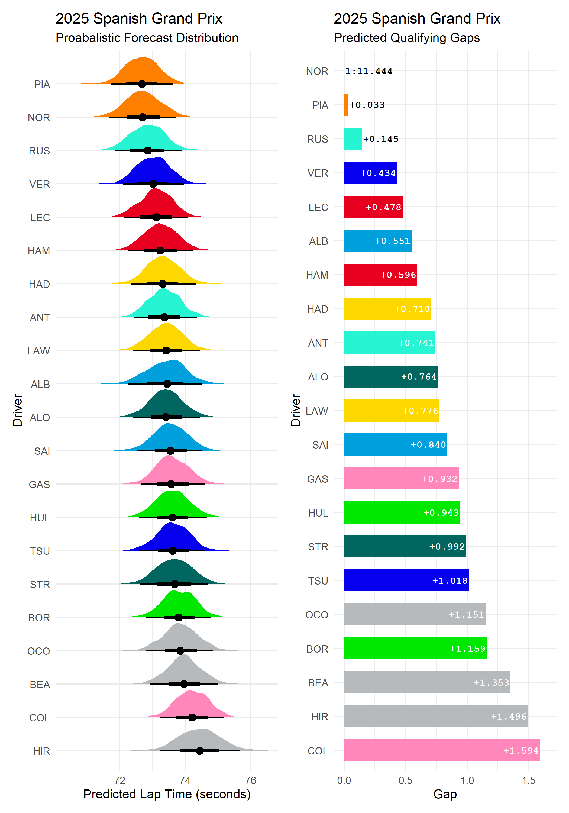

Bayesian statistics model methodology
================
Compiled: 2026-04-29

This vignette highlights the reasoning and methodology used to generate
probabilistic qualifying predictions within `laps-of-judgement` via
Bayesian hierarchical modelling.

### Load in the data

Practice session data for the given year and round is collected via
`FastF1` using the `python/get_fp_data.py`. You must run this script
before attempting to generate qualifying time predictions.

``` r
library(brms)
library(cmdstanr)
library(dplyr)
library(ggplot2)
library(lubridate)
library(parallel)
library(tidybayes)
library(patchwork)

# Load the utility functions
source(here::here("R/utils.R"))

# Set the default argument parameters
target_race <- "Spanish Grand Prix"
year <- 2025
max_stint <- 6

# Load in the lap time data
data <- read.csv(glue::glue(here::here("data/processed/all_p_laps_{year}.csv"))) |>
  filter(RoundName == target_race) |>
  parse_lap_times() |>
  add_elapsed_time()
```

The resulting data frame contains one row per practice lap for the
specified round.

### Filter the practice session data

To improve the accuracy of the qualifying simulation, laps are filtered
to retain only those representative of a low-fuel, single-lap
‘qualifying’ efforts. Laps on used tyres, in-laps, out-laps, and those
affected by traffic or yellow flags are removed. A maximum stint length
of `max_stint` laps is applied to exclude long run data, and the 107%
rule drops any remaining outliers that would distort the prior.

``` r
# Filter for qualifying runs
quali_data <- filter_qualifying_laps(data, max_stint = max_stint)
stopifnot(mean(is.na(data$LapTime_sec)) < 0.1)

# Apply 107% rule
fastest_lap <- min(quali_data$LapTime_sec)
model_data_q <- filter(quali_data, LapTime_sec <= fastest_lap * 1.07)
```

### Bayesian statistics

The initial assumptions (priors) of the Bayesian inference model account
for the average lap time: `normal(intercept_prior, 5)` and normalises
erratic swings in lap times using the standard deviation and residual
error (sigma) of lap times. An `exponential(1)` for the standard
deviation of group-level effects and residual error gives a mean of ~1
second; a loose prior to protect against large teammate discrepancies in
qualifying sessions, although this may get tightened in future.

Applying a Gaussian likelihood provides a highly robust and
computationally efficient approximation for valid push laps, which tend
to cluster tightly towards the mean. While the Gaussian model serves as
an effective baseline for this statistical inference, future iterations
exploring Log-Normal or Ex-Gaussian distributions could theoretically
better capture the inherent right-hand skew of the stochastic data.

``` r
# Intercept prior centres the median lap time
intercept_prior <- round(median(model_data_q$LapTime_sec, na.rm = TRUE))

# Fit the Bayesian model
fit_quali <- brm(
  LapTime_sec ~ log(Weekend_Mins_Elapsed + 1) + Driver + (1 | Team),
  data = model_data_q,
  family = gaussian(),
  prior = c(
    prior_string(paste0("normal(", intercept_prior, ", 5)"),
                 class = "Intercept"),
    prior(exponential(1), class = "sd"),
    prior(exponential(1), class = "sigma")
  ),
  chains = 4,
  iter = 4000,
  warmup = 1000,
  cores = detectCores(),
  threads = threading(max(1, floor(detectCores(
  ) / 4))),
  backend = "cmdstanr",
  stan_model_args = list(stanc_options = list("O1"))
)
```

This approach attempts to account for the track evolution over the
weekend (`log(Weekend_Mins_Elapsed + 1)`) to pull lap times down as the
grip improves. Individual driver lap times were previously shrunk
towards a team average to prevent extreme outliers
(`1 | Team / Driver`). Alternatively, providing each driver with a free
intercept provides better inter-team pace differentiation:
`Driver + (1 | Team)`.

The model deploys Markov Chain Monte Carlo (MCMC) algorithms via Stan
(`backend = "cmdstanr"`), running 4 parallel chains for 4000 iterations
to explore thousands of valid parameter combinations.

The posterior distribution output provides a spectrum of probable lap
times for each driver. Below, the 1st percentile (`0.01`) of each
driver’s simulated lap distribution is selected in an attempt mimic the
optimal lap time achieveable.


