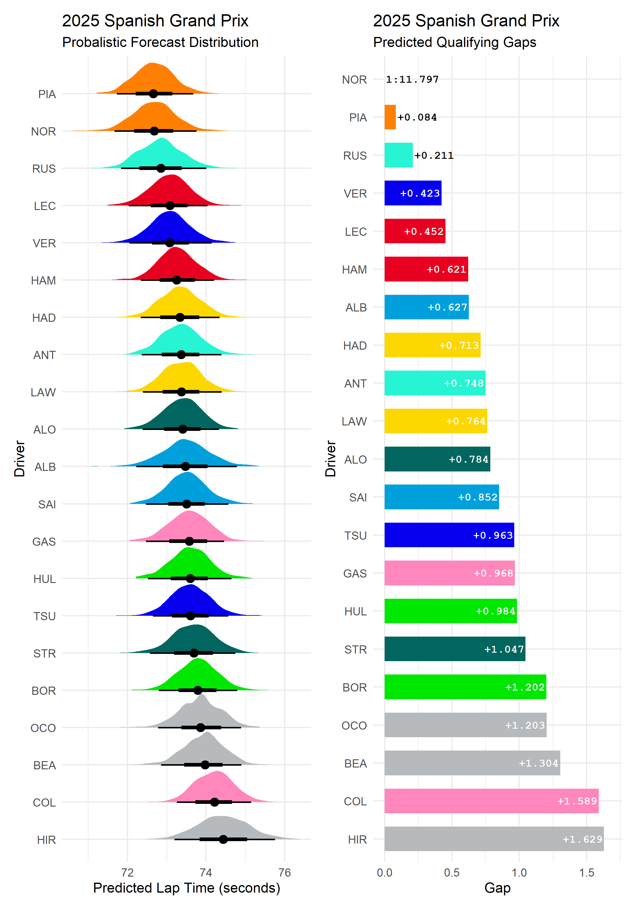

Bayesian statistics model methodology
================
Compiled: 2026-05-07

This vignette highlights the reasoning and methodology used to generate
qualifying predictions using a probabilistic Bayesian hierarchical
model.

### Load in the data

Practice session data for the given year and round is collected via
`FastF1` using the `python/get_data.py`. You must run this script before
attempting to generate qualifying time predictions.

``` r
library(brms)
library(cmdstanr)
library(dplyr)
library(ggplot2)
library(lubridate)
library(parallel)
library(tidybayes)
library(patchwork)

# Load the utility functions
source(here::here("R/utils.R"))

# Set the default argument parameters
target_race <- "Spanish Grand Prix"
year <- 2025
max_stint <- 6

# Load in the lap time data
data <- read.csv(glue::glue(here::here("data/processed/all_p_laps_{year}.csv"))) |>
  filter(RoundName == target_race) |>
  parse_lap_times() |>
  add_elapsed_time()
```

The resulting data frame contains one row per practice lap for the
specified round.

### Filter the practice session data

To improve the accuracy of the qualifying simulation, laps are filtered
to retain only those representative of a low-fuel, single-lap
‘qualifying’ efforts. Laps on used tyres, in-laps, out-laps, and those
affected by traffic or yellow flags are removed. A maximum stint length
of `max_stint` laps is applied to exclude long run data, and the 107%
rule drops any remaining outliers that would distort the prior.

``` r
# Filter for qualifying runs
quali_data <- filter_qualifying_laps(data, max_stint = max_stint)
stopifnot(mean(is.na(data$LapTime_sec)) < 0.1)

# Apply 107% rule
fastest_lap <- min(quali_data$LapTime_sec)
model_data_q <- filter(quali_data, LapTime_sec <= fastest_lap * 1.07)
```

### Bayesian statistics

The model intercept is centred at the median session lap time
(`normal(intercept_prior, 5)`) providing an informative but weakly
regularising prior that prevents prediction of physically impossible lap
times. Standard deviation and residual error priors use
`exponential(1)`, placing a mean of approximately one second on both the
between-driver spread and the within-driver noise, which is a plausible
loose prior for a modern F1.

Applying a Gaussian likelihood provides a highly robust and
computationally efficient approximation for valid push laps, which tend
to cluster tightly towards the mean.

``` r
# Intercept prior centres the median lap time
intercept_prior <- round(median(model_data_q$LapTime_sec, na.rm = TRUE))

# Fit the Bayesian model
fit_quali <- brm(
  LapTime_sec ~ log(Weekend_Mins_Elapsed + 1) + Driver + (1 | Team),
  data = model_data_q,
  family = gaussian(),
  prior = c(
    prior_string(paste0("normal(", intercept_prior, ", 5)"),
                 class = "Intercept"),
    prior(exponential(1), class = "sd"),
    prior(exponential(1), class = "sigma")
  ),
  chains = 4,
  iter = 4000,
  warmup = 1000,
  cores = detectCores(),
  threads = threading(max(1, floor(detectCores(
  ) / 4))),
  backend = "cmdstanr",
  stan_model_args = list(stanc_options = list("O1"))
)
```

This approach attempts to account for the track evolution over the
weekend (`log(Weekend_Mins_Elapsed + 1)`) to pull lap times down as the
grip improves. Individual driver lap times were previously shrunk
towards a team average to prevent extreme outliers
(`1 | Team / Driver`). Alternatively, providing each driver with a free
intercept provides better inter-team pace, while still providing
partial-pooling for per-team random intercepts: `Driver + (1 | Team)`.

The model deploys Markov Chain Monte Carlo (MCMC) algorithms via Stan
(`backend = "cmdstanr"`), running 4 parallel chains for 4000 iterations,
with a 1000 warm up run phase, totalling 1200 total draws.

The posterior distribution output provides a spectrum of probable lap
times for each driver. Below, the 5th percentile (`0.05`) of each
driver’s simulated lap distribution is selected in an attempt mimic the
optimal lap time achievable.



This posterior distribution justifies the selection of the top 5th
percentile of lap times for the prediction. Qualifying selects for peak
pace rather than average pace, as a result, a driver’s fastest lap is
more representative benchmark for their performance over their mean lap
times (see the [evaluation vignette](evaluating_model_vignette.md)).
