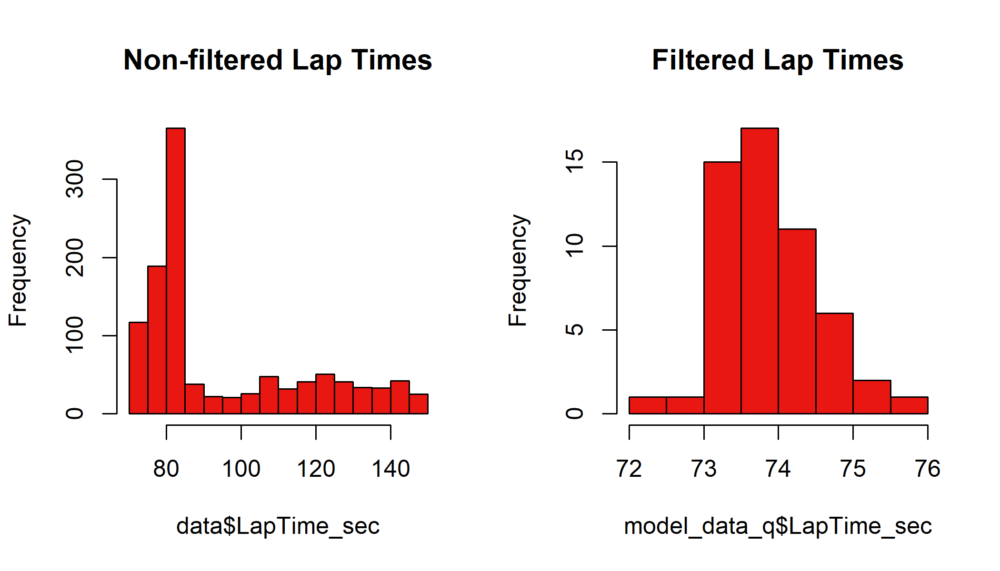

Bayesian statistics model methodology
================
Compiled: 2026-06-05

This vignette highlights the reasoning and methodology used to generate
qualifying predictions using a probabilistic Bayesian hierarchical
model.

### Load in the data

Practice session data for the given year and round is collected via
`FastF1`. You must run the `python/get_data.py` script for a given
season before attempting to generate qualifying time predictions.

``` r
library(brms)
library(cmdstanr)
library(dplyr)
library(ggplot2)
library(lubridate)
library(parallel)
library(tidybayes)
library(patchwork)

# Load the utility functions
source(here::here("R/utils.R"))

# Set the default argument parameters
target_race <- "Spanish Grand Prix"
year <- 2025
max_stint <- 6

# Load in the lap time data
data <- read.csv(glue::glue(here::here("data/processed/all_p_laps_{year}.csv"))) |>
  filter(RoundName == target_race) |>
  parse_lap_times() |>
  add_elapsed_time()
```

<details>

<summary>

Data contains one row per practice lap for the specified round.
</summary>

    ##                     Time Driver DriverNumber                LapTime LapNumber
    ## 1 0 days 00:19:38.127000    VER            1 0 days 00:01:16.802000         2
    ## 2 0 days 00:21:53.120000    VER            1 0 days 00:02:14.993000         3
    ## 3 0 days 00:23:08.925000    VER            1 0 days 00:01:15.805000         4
    ## 4 0 days 00:25:30.152000    VER            1 0 days 00:02:21.227000         5
    ## 5 0 days 00:27:42.570000    VER            1 0 days 00:02:12.418000         6
    ##   Stint             PitOutTime              PitInTime            Sector1Time
    ## 1     1                                               0 days 00:00:22.782000
    ## 2     1                                               0 days 00:00:50.693000
    ## 3     1                                               0 days 00:00:22.270000
    ## 4     1                        0 days 00:25:27.453000 0 days 00:00:44.629000
    ## 5     2 0 days 00:25:43.995000                        0 days 00:00:51.475000
    ##              Sector2Time            Sector3Time     Sector1SessionTime
    ## 1 0 days 00:00:30.530000 0 days 00:00:23.490000 0 days 00:18:44.107000
    ## 2 0 days 00:00:57.385000 0 days 00:00:26.915000 0 days 00:20:28.820000
    ## 3 0 days 00:00:30.384000 0 days 00:00:23.151000 0 days 00:22:15.390000
    ## 4 0 days 00:00:56.076000 0 days 00:00:40.522000 0 days 00:23:53.554000
    ## 5 0 days 00:00:48.210000 0 days 00:00:32.733000 0 days 00:26:21.627000
    ##       Sector2SessionTime     Sector3SessionTime SpeedI1 SpeedI2 SpeedFL SpeedST
    ## 1 0 days 00:19:14.637000 0 days 00:19:38.127000     284     291     285     323
    ## 2 0 days 00:21:26.205000 0 days 00:21:53.120000     106     191     287     108
    ## 3 0 days 00:22:45.774000 0 days 00:23:08.925000     288     306     287     323
    ## 4 0 days 00:24:49.630000 0 days 00:25:30.152000     130     155      NA     119
    ## 5 0 days 00:27:09.837000 0 days 00:27:42.570000     140     234     288     147
    ##   IsPersonalBest Compound TyreLife FreshTyre            Team
    ## 1           True     HARD        2      True Red Bull Racing
    ## 2          False     HARD        3      True Red Bull Racing
    ## 3           True     HARD        4      True Red Bull Racing
    ## 4          False     HARD        5      True Red Bull Racing
    ## 5          False     HARD        6     False Red Bull Racing
    ##             LapStartTime        LapStartDate TrackStatus Position Deleted
    ## 1 0 days 00:18:21.325000 2025-05-30 11:35:07           1       NA      NA
    ## 2 0 days 00:19:38.127000 2025-05-30 11:36:24           1       NA      NA
    ## 3 0 days 00:21:53.120000 2025-05-30 11:38:39           1       NA      NA
    ## 4 0 days 00:23:08.925000 2025-05-30 11:39:55           1       NA      NA
    ## 5 0 days 00:25:30.152000 2025-05-30 11:42:16           1       NA      NA
    ##   DeletedReason FastF1Generated IsAccurate          RoundName Session isSprint
    ## 1            NA           False       True Spanish Grand Prix     FP1    False
    ## 2            NA           False       True Spanish Grand Prix     FP1    False
    ## 3            NA           False       True Spanish Grand Prix     FP1    False
    ## 4            NA           False      False Spanish Grand Prix     FP1    False
    ## 5            NA           False      False Spanish Grand Prix     FP1    False
    ##   LapTime_sec Weekend_Mins_Elapsed
    ## 1      76.802             3.070950
    ## 2     134.993             4.350983
    ## 3      75.805             6.600867
    ## 4     141.227             7.864283
    ## 5     132.418            10.218067

</details>

### Filter the practice session data

Practice laps are filtered to retain only those representative of a
low-fuel, single-lap ‘qualifying’ efforts. Laps on used tyres, in-laps,
out-laps, and those affected by traffic or yellow flags are removed. A
maximum stint length of `max_stint` laps is applied to exclude long run
data, and the 107% rule drops any remaining outliers that would distort
the prior.

> NOTE: To improve the accuracy of the qualifying simulation by
> increasing accepted lap times, sprint weekend filtering approaches
> differ to include all laps from each driver’s fastest stint,
> regardless of compound or length.

``` r
# Sprint flag
sprint_flag <- unique(as.logical(data$isSprint))

# Filter for qualifying runs
quali_data <- filter_qualifying_laps(data, max_stint, is_sprint = sprint_flag)
stopifnot(mean(is.na(data$LapTime_sec)) < 0.1)

# Apply 107% rule
fastest_lap <- min(quali_data$LapTime_sec)
model_data_q <- filter(quali_data, LapTime_sec <= fastest_lap * 1.07)
```

### Bayesian statistics

The model intercept is centred at the median session lap time
(`normal(intercept_prior, 5)`) providing an informative but weakly
regularising prior that prevents prediction of physically impossible lap
times. Standard deviation and residual error priors use
`exponential(1)`, placing a mean of approximately one second on both the
between-driver spread and the within-driver noise.

A Gaussian family fit provides a highly robust and computationally
efficient approximation for valid push laps, which tend to cluster
tightly towards the mean.



``` r
# Intercept prior centres the median lap time
intercept_prior <- round(median(model_data_q$LapTime_sec, na.rm = TRUE))

# Fit the Bayesian model
fit_quali <- brm(
  LapTime_sec ~ log(Weekend_Mins_Elapsed + 1) + Driver + (1 | Team),
  data = model_data_q,
  family = gaussian(),
  prior = c(
    prior_string(paste0("normal(", intercept_prior, ", 5)"),
                 class = "Intercept"),
    prior(exponential(1), class = "sd"),
    prior(exponential(1), class = "sigma")
  ),
  chains = 4,
  iter = 4000,
  warmup = 1000,
  cores = detectCores(),
  threads = threading(max(1, floor(detectCores(
  ) / 4))),
  backend = "cmdstanr",
  stan_model_args = list(stanc_options = list("O1"))
)
```

> NOTE: Sprint format weekends include additional model formula
> parameters (`LapTime_sec | weights(Weighting)` and
> `sigma ~ log(LapCount)` to factor for the different stint lengths or
> compounds) and priors, currently defining the MEDIUM and HARD
> compounds as 0.5 and 1.0 units slower than the SOFT, respectively.

This approach attempts to account for the track evolution over the
weekend (`log(Weekend_Mins_Elapsed + 1)`) to pull lap times down as the
grip improves. Individual driver lap times were previously shrunk
towards a team average to prevent extreme outliers
(`1 | Team / Driver`). Alternatively, providing each driver with a free
intercept provides better inter-team pace, while still providing
partial-pooling for per-team random intercepts: `Driver + (1 | Team)`.

The model deploys Markov Chain Monte Carlo (MCMC) algorithms via Stan
(`backend = "cmdstanr"`), running 4 parallel chains for 4000 iterations,
with a 1000 warm up run phase, totalling 1200 total draws.

The posterior distribution output provides a spectrum of probable lap
times for each driver. Below, the 5th percentile (`0.05`) of each
driver’s simulated lap distribution is selected in an attempt mimic the
optimal lap time achievable.


This posterior distribution justifies the selection of the top 5th
percentile of lap times for the prediction. Qualifying selects for peak
performance rather than average pace, as a result, a driver’s fastest
lap is more representative benchmark for their performance over their
mean lap times (see the [evaluation
vignette](evaluating_model_vignette.md)).
