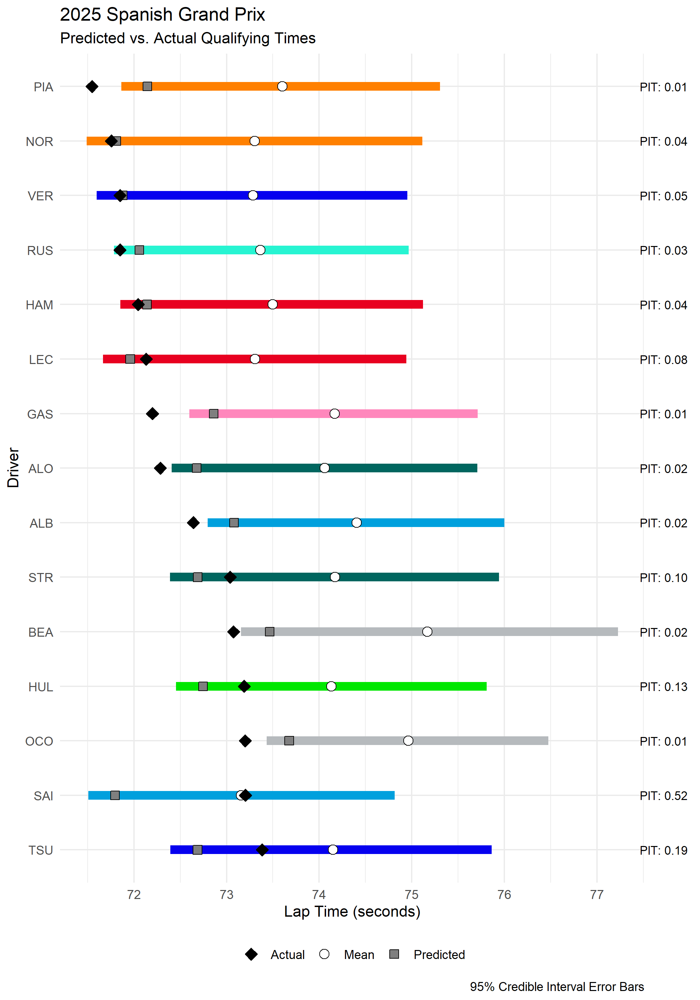
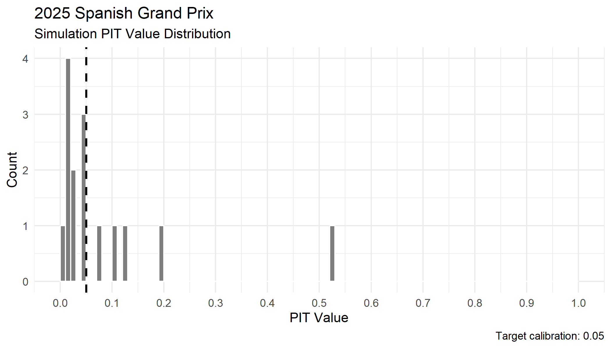

Simulation model evaluation methodology
================
Compiled: 2026-04-29

This vignette highlights and explains the methodology behind the
evaluation of prediction models for qualifying sessions generated by
`laps-of-judgement` via Bayesian hierarchical modelling.

### Load in the data

Load the fitted Bayesian model data (produced by running `R/model.R`).

``` r
library(brms)
library(dplyr)
library(ggplot2)
library(lubridate)

# Load the utility functions
source(here::here("R/utils.R"))

# Set the default argument parameters
target_race <- "Spanish Grand Prix"
year <- 2025

event_name <- gsub(" ", "_", target_race)

# Load the pre-fitted models
fit_quali <- readRDS(here::here(paste0("outputs/fit_quali_", event_name, ".rds")))
model_data_q <- readRDS(here::here(paste0("outputs/model_data_", event_name, ".rds")))
```

### Predict lap times from posterior draws

The predicted qualifying times are calculated from the 5th percentile of
the posterior draw distribution per driver - reflective of a “full send”
push lap expected in qualifying, against the relatively calmer practice
session attempts.

``` r
# Simulate times
simulated_quali_laps <- posterior_predict(
  fit_quali,
  newdata = new_quali_data,
  allow_new_levels = TRUE
)

# Generate a predicted grid data.frame
predicted_grid <- data.frame(
  Driver = new_quali_data$Driver,
  Team = new_quali_data$Team,
  Predicted_Time = apply(simulated_quali_laps, 2, quantile, probs = 0.05)
) |>
  arrange(Predicted_Time) |>
  mutate(Predicted_Grid_Position = row_number())
```

### Generating an evaluation

To evaluate the qualifying simulation, the target session must have
already been completed, and the qualifying data loaded using
`python python/get_data.py --session_type Q --year 2025`, for example.

``` r
# Only proceed if qualifying results have been retrieved
if (file.exists(glue::glue(here::here("data/processed/all_q_laps_{year}.csv")))) {
  q_data <- read.csv(glue::glue(here::here("data/processed/all_q_laps_{year}.csv"))) |>
    filter(RoundName == target_race) |>
    parse_lap_times() |>
    add_elapsed_time() |>
    select(Driver, Team, LapTime_sec) |>
    group_by(Driver) |>
    slice_min(LapTime_sec, n = 1) |>
    ungroup() |>
    arrange(LapTime_sec) |>
    left_join(team_colours |> select(Team, Colour), by = "Team")

  if (nrow(q_data) != 0) {
    # Calculate summary stats for prediction accuracy
    colnames(simulated_quali_laps) <- new_quali_data$Driver
    pred_summaries <- apply(simulated_quali_laps, 2, function(x) {
      tibble(
        Pred_Mean = mean(x),
        Pred_Median = median(x),
        Predicted_Time = quantile(x, 0.05),
        Lower_95 = quantile(x, 0.025),
        Upper_95 = quantile(x, 0.975)
      )
    }) |>
      bind_rows(.id = "Driver")

    # Merge and compute PIT scores
    evaluation_data <- q_data |>
      inner_join(pred_summaries, by = "Driver") |>
      rowwise() |>
      mutate(PIT_Value = mean(simulated_quali_laps[, Driver] <= LapTime_sec)) |>
      ungroup()
  } else {
    cat("Collect qualifying data from this season to evaluate the simulations.")
  }
}
```

The **probability integral transform**, calculated by
`PIT_Value = mean(simulated_quali_laps[, Driver] <= LapTime_sec)` (PIT),
provides a calibration metric for the lap time predictions per driver.
For a given driver, the PIT value is the proportion of simulated draws
where the true lap time sits on the simulated predictive distribution.
The workflow targets the 5th percentile as the qualifying time
prediction, a well-calibrated forecast should produce PIT values
clustered around `0.05`. Values can be interpreted as follows:

- `PIT ≈ 0.05`: The actual lap time aligns with the targeted push-lap
  percentile. The model is well-calibrated for this driver.
- `PIT < 0.05`: The driver went faster than the vast majority of
  simulated draws. This suggests the model underestimated their pace -
  potentially due to sandbagging during practice, a significant car
  setup change, or track conditions improving beyond what was seen in
  the practice data.
- `PIT > 0.05`: The actual lap time was slower than expected relative to
  the simulated distribution. This could reflect a driver failing to
  extract peak pace in qualifying, whether through traffic, a mistake,
  or a mechanical issue (or a poorly calibrated model!).
- `PIT ≈ 0.50`: The actual time sits near the median of the simulated
  distribution, suggesting the driver replicated their typical practice
  pace rather than producing a representative push lap.
- `PIT = 0.00`: The observed time falls entirely outside (faster than)
  the simulated distribution. This is a strong signal of either
  substantial sandbagging in practice, or model misspecification for
  that driver.



By plotting the distribution of the PIT values calculated per driver, we
can observe the relative accuracy of the simulation framework against
the target calibration value.


