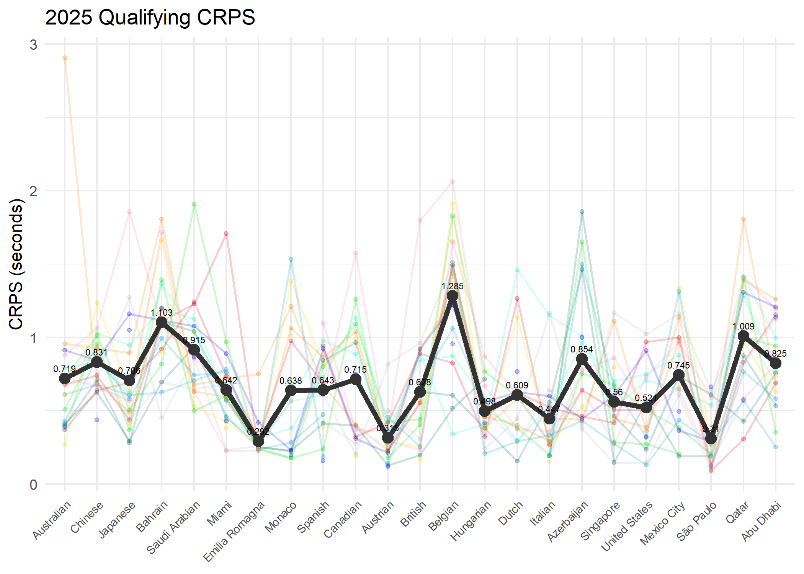
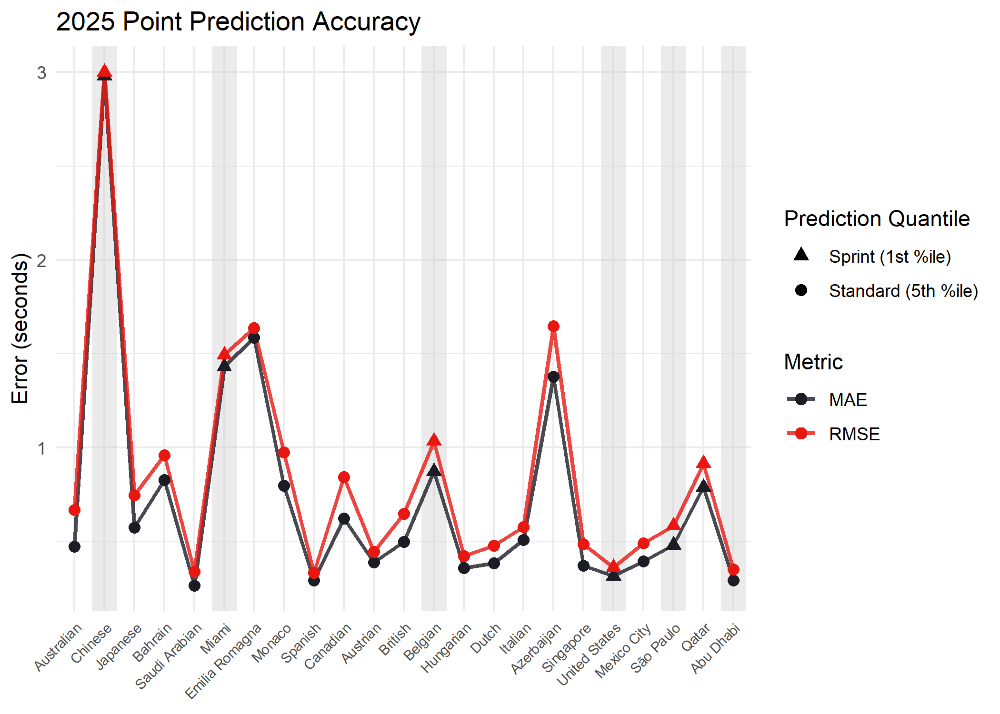

Model evaluation and scoring methodology
================
Compiled: 2026-07-24

This vignette highlights methodology for evaluating the accuracy of the
Bayesian probabilistic model distribution of predicted lap times across
the 2025 season.

### Evaluating model performance

A conditional continuous ranked probability score (CRPS) is a method of
model evaluation that compares a single ground truth value - in this
case the actual qualifying time achieved by the driver - against the
distribution of lap times forecast by the model simulation.

``` r
library(scoringRules)

evaluate_model <- function(target_race, year) {
  # Find the event model data
  event_name <- gsub(" ", "_", target_race)
  fit_quali <- readRDS(here::here(paste0("outputs/fit_quali_", event_name, ".rds")))
  model_data_q <- readRDS(here::here(paste0("outputs/model_data_", event_name, ".rds")))

  sprint_flag <- unique(as.logical(model_data_q$isSprint))

  # Build the new data
  driver_teams <- model_data_q |> select(Driver, Team) |> distinct()

  new_quali_data <- data.frame(
    Driver = driver_teams$Driver,
    Team = driver_teams$Team,
    Weekend_Mins_Elapsed = max(model_data_q$Weekend_Mins_Elapsed, na.rm = TRUE)
  )

  # Additional sprint configurations
  if (sprint_flag) {
    new_quali_data$Compound = factor("SOFT",
                                     levels = unique(model_data_q$Compound))
    new_quali_data$LapCount = max(model_data_q$LapCount, na.rm = TRUE)
  }

  dropped_levels <- setdiff(levels(new_quali_data$Driver),
                            levels(fit_quali$data$Driver))

  # Simulate predicted lap times
  new_quali_data <- new_quali_data |>
    filter(!Driver %in% dropped_levels) |>
    mutate(Driver = droplevels(Driver)) |>
    left_join(constructor_offset |> select(Team, PctOffset), by = "Team")

  simulated_quali_laps <- posterior_predict(
    fit_quali,
    newdata = new_quali_data,
    allow_new_levels = TRUE
  )

  # Pull the true data
  if (file.exists(glue::glue(here::here("data/processed/all_q_laps_{year}.csv")))) {
    q_data <- read.csv(glue::glue(here::here("data/processed/all_q_laps_{year}.csv"))) |>
      filter(RoundName == target_race) |>
      parse_lap_times() |>
      add_elapsed_time() |>
      select(Driver, Team, LapTime_sec) |>
      group_by(Driver) |>
      slice_min(LapTime_sec, n = 1, with_ties = FALSE) |>
      ungroup() |>
      arrange(LapTime_sec)
  }

  # Evaluate the simulation draws against the ground truth
  eval_data <- new_quali_data |>
    select(Driver) |>
    left_join(q_data |> select(Driver, Team, LapTime_sec), by = "Driver")
  
  return(
    list(
      "Fit" = fit_quali,
      "Simulation" = simulated_quali_laps,
      "Evaluation" = eval_data,
      "Sprint" = sprint_flag
    )
  )
}
```

By scoring each event of the 2025 season, we map the accuracy of the lap
time prediction distribution and the quality of the model logic in
producing reliable forecasts.

The Las Vegas Grand Prix was omitted from the following analysis, as
qualifying was run in wet conditions and could not be represented by the
dry laps captured in the practice data. In addition, an extreme outlier
at the Dutch Grand Prix (Stroll’s CRPS \> 21.0) - likely due to minimal
valid stint collection - was removed to avoid its heavy skew on the
average CRPS.

``` r
library(dplyr)
library(tidyr)
library(purrr)

# 2025 event names
events <- c(
  "Australian", "Chinese", "Japanese", "Bahrain", "Saudi Arabian", "Miami",
  "Emilia Romagna", "Monaco", "Spanish", "Canadian", "Austrian", "British",
  "Belgian", "Hungarian", "Dutch", "Italian", "Azerbaijan", "Singapore",
  "United States", "Mexico City", "São Paulo", "Las Vegas", "Qatar", "Abu Dhabi"
)

# Calculate score for each event
evaluated_events <- list()
for (gp in events){
  event_data <- evaluate_model(target_race = paste0(gp, " Grand Prix"), year = 2025)
  
  # Calculate CRPS from the prediction distribution
  crps_vals <- crps_sample(
    y = event_data$Evaluation$LapTime_sec[which(!is.na(event_data$Evaluation$LapTime_sec))],
    dat = t(event_data$Simulation[, which(!is.na(event_data$Evaluation$LapTime_sec)),
                                 drop = FALSE])
  )

  # Arrange output tibble
  crps_by_driver <- tibble(
    Driver = event_data$Evaluation$Driver[which(!is.na(event_data$Evaluation$LapTime_sec))],
    Team = event_data$Evaluation$Team[which(!is.na(event_data$Evaluation$LapTime_sec))],
    crps   = crps_vals
  ) |>
    arrange(crps)

  evaluated_events[[gp]] <- crps_by_driver
}

# Collate season table
season_crps <- evaluated_events |>
  imap_dfr(~ mutate(.x, Event = .y)) |>
  pivot_wider(names_from = Event, values_from = crps) |>
  select(Driver, Team, all_of(events))
```



This represents a global season average for model deviation of 0.69
seconds per lap.

Breaking this down further, analysis of driver level CRPS, shows that,
of the drivers to complete the full season, most cluster around this
average. Albon is most consistently well predicted, perhaps reflective
of a well-established driver-team combination.

Most of the full season rookies (Antonelli, Bearman, Bortoletto and
Hadjar) are, as expected, among the most difficult to predict.

***Driver Season Average CRPS***

| Driver | Team            | Season Mean CRPS |
|:-------|:----------------|:----------------:|
| ALB    | Williams        |      0.475       |
| ALO    | Aston Martin    |      0.532       |
| STR    | Aston Martin    |      0.557       |
| OCO    | Haas F1 Team    |      0.568       |
| HUL    | Kick Sauber     |      0.596       |
| LAW    | Racing Bulls    |      0.631       |
| TSU    | Red Bull Racing |      0.643       |
| HAM    | Ferrari         |      0.673       |
| SAI    | Williams        |      0.678       |
| LEC    | Ferrari         |      0.701       |
| BEA    | Haas F1 Team    |      0.731       |
| RUS    | Mercedes        |      0.744       |
| VER    | Red Bull Racing |      0.746       |
| BOR    | Kick Sauber     |      0.771       |
| HAD    | Racing Bulls    |      0.774       |
| ANT    | Mercedes        |      0.783       |
| GAS    | Alpine          |      0.803       |
| PIA    | McLaren         |      0.807       |
| NOR    | McLaren         |      0.811       |
| LAW    | Red Bull Racing |        NA        |
| TSU    | Racing Bulls    |        NA        |
| DOO    | Alpine          |        NA        |
| COL    | Alpine          |        NA        |

Observing this pattern across the constructors, it is notable that the
top constructor, McLaren, represents the most inaccurate forecast. This
is likely due to an inability of the model to account for jumps in pace
during the final qualifying session (Q3) relative to the other teams. In
addition, “sandbagging” (deliberate hiding of true performance) during
the practice session by the top teams, could also be a source of the
inaccuracy.

Conversely, Alpine’s higher forecast inaccuracy might be largely
influenced by Gasly’s performance and a driver able to extract peak
performance out of a difficult car.

***Team Season Average CRPS***

| Team            | Team Mean CRPS |
|:----------------|:--------------:|
| Aston Martin    |     0.545      |
| Williams        |     0.577      |
| Haas F1 Team    |     0.649      |
| Kick Sauber     |     0.683      |
| Ferrari         |     0.687      |
| Red Bull Racing |     0.695      |
| Racing Bulls    |     0.703      |
| Mercedes        |     0.763      |
| Alpine          |     0.803      |
| McLaren         |     0.809      |

### Percentile Point Prediction Accuracy

For the final lap time, the 5th percentile (1st percentile for sprint
format weekends) is taken as a point prediction. To evaluate the
accuracy of this approach, we calculate both the Mean Absolute Error
(MAE) and Root Mean Squared Error (RMSE). The MAE provides a measure of
the average deviation between the predicted and actual lap times. RMSE
penalises larger errors more heavily, revealing the model’s sensitivity
to extreme forecasting misses and highlighting events where
unpredictable variables skewed the accuracy.

``` r
# Calculate score for each event
mag_evaluated_events <- list()
for (gp in events) {
  event_data <- evaluate_model(target_race = paste0(gp, " Grand Prix"), year = 2025)
  
  # Pace quantile threshold
  pace_probs <- ifelse(event_data$Sprint == TRUE, 0.01, 0.05)
  
  mag_data <- event_data$Evaluation |>
    mutate(
      Predicted_Time = apply(event_data$Simulation, 2, quantile, 
                             probs = pace_probs),
      Error = LapTime_sec - Predicted_Time,
      Abs_Error = abs(Error),
      Sq_Error = Error^2
    ) |>
    arrange(Predicted_Time) |>
    mutate(Predicted_Grid_Position = row_number())
  
  mag_evaluated_events[[gp]] <- mag_data |>
    filter(!is.na(LapTime_sec)) |>
    filter(!(gp == "Dutch" & Driver == "STR")) |>
    summarise(MAE = mean(Abs_Error), RMSE = sqrt(mean(Sq_Error))) |>
    mutate(
      Weekend_Format = ifelse(
        event_data$Sprint == TRUE,
        "Sprint (1st %ile)",
        "Standard (5th %ile)"
      )
    )
}

season_errors <- imap_dfr(mag_evaluated_events, ~ mutate(.x, Event = .y))
season_errors_long <- season_errors |>
  mutate(Event = factor(Event, levels = events)) |>
  filter(Event != "Las Vegas") |>
  pivot_longer(
    cols = c(MAE, RMSE),
    names_to = "Metric",
    values_to = "Error_Sec"
  )
```



Over the course of the 2025 season, the percentile point predictions
yielded a global average MAE of 1.459 seconds, with an RMSE of 1.577
seconds. The sprint races have a marked impact on these predictions

***Average MAE and RMSE of Weekend Format Point Prediction Accuracy***

| Format              | Average MAE | Average RMSE |
|:--------------------|:-----------:|:------------:|
| Sprint (1st %ile)   |    1.144    |    1.231     |
| Standard (5th %ile) |    0.589    |    0.708     |

The significant in accuracy between event formats highlights a clear
calibration issue when applying the model to sprint weekends. On
standard weekends, the 5th percentile predictions yield a robust MAE of
0.589 seconds and a RMSE of 0.708 seconds. The MAE demonstrates that the
model is, on average, within half a second of the true lap time, while
the tight margin between the MAE and RMSE indicates a stable baseline
with very few extreme outlier misses.

In contrast, sprint weekends suffer a severe degradation in precision,
with MAE and RMSE inflating to 1.144 and 1.231 seconds, respectively
(although significantly influenced by the Chinese Grand Prix). Because
sprint weekends offer only a single practice session, the model’s prior
information likely severely widens the distribution of posterior
forecast, leading to inaccurate point predictions.

<hr>

#### Current Model

Evaluations in this document were drawn from models constructed using
the following function:

``` r
function (data, is_sprint = FALSE) 
{
    intercept_prior <- round(median(data$LapTime_sec, na.rm = TRUE))
    pct_offset_scale <- intercept_prior/100
    pct_offset_prior <- prior_string(paste0("normal(", round(pct_offset_scale, 
        2), ", ", round(pct_offset_scale/2, 2), ")"), class = "b", 
        coef = "PctOffset")
    if (is_sprint) {
        model_formula <- bf(LapTime_sec | weights(Weighting) ~ 
            log(Weekend_Mins_Elapsed + 1) + Compound + PctOffset + 
                (1 | Team) + (1 | Driver), sigma ~ log(LapCount))
        model_priors <- c(prior_string(paste0("normal(", intercept_prior, 
            ", 5)"), class = "Intercept"), prior(exponential(1), 
            class = "sd"), prior(normal(0, 1), class = "b", dpar = "sigma"), 
            pct_offset_prior)
        if ("MEDIUM" %in% unique(data$Compound)) {
            model_priors <- c(model_priors, prior(normal(0.5, 
                0.3), class = "b", coef = "CompoundMEDIUM"))
        }
        if ("HARD" %in% unique(data$Compound)) {
            model_priors <- c(model_priors, prior(normal(1, 0.3), 
                class = "b", coef = "CompoundHARD"))
        }
    }
    else {
        model_formula <- bf(LapTime_sec ~ log(Weekend_Mins_Elapsed + 
            1) + Driver + PctOffset + (1 | Team))
        model_priors <- c(prior_string(paste0("normal(", intercept_prior, 
            ", 5)"), class = "Intercept"), prior(exponential(1), 
            class = "sd"), prior(exponential(1), class = "sigma"), 
            pct_offset_prior)
    }
    brm(formula = model_formula, data = data, family = gaussian(), 
        prior = model_priors, chains = 4, iter = 4000, warmup = 1000, 
        cores = detectCores(), threads = threading(max(1, floor(detectCores()/4))), 
        backend = "cmdstanr", stan_model_args = list(stanc_options = list("O1")))
}
```
