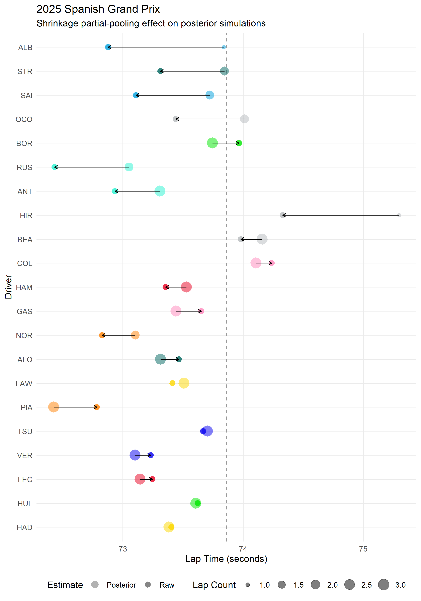

Visualising partial-pooling shrinkage
================
Compiled: 2026-05-08

This vignette demonstrates the partial-pooling effect introduced by the
`(1 | Team)` random intercept term in the hierarchical Bayesian model.
By comparing each driver’s raw practice pace against their model
posterior, we can see where the model trusts the observed data and where
it overrides it in favour of the constructor’s baseline pace.

### Partial-pooling

The model formula
`LapTime_sec ~ log(Weekend_Mins_Elapsed + 1) + Driver + (1 | Team)`
contains two distinct ways of handling group membership:

- `Driver` is a **fixed effect** where each driver receives an
  independent intercept estimated solely from their own laps, with no
  information shared between drivers.
- `(1 | Team)` is a **random effect** where the constructor intercepts
  are treated as draws from a shared normal distribution, whose spread
  (`sd`) is itself estimated from the data.

Because every constructor’s intercept is anchored to the same prior,
teams with limited practice data cannot stray far from the field
average.

Drivers inherit this regularisation indirectly and their predictions
combine their own fixed-effect coefficient with their constructor’s
partially-pooled intercept.

### Measuring shrinkage

To observe the measured shrinkage, the 5th percentile of raw observed
lap time and the posterior draws distribution are used to calculate the
shrinkage fraction:

    shrinkage_fraction = (raw_mean - posterior_mean) / (raw_mean - grand_mean)

A value near 0 means the posterior stayed close to the raw estimate. A
value near 1 means the posterior was pulled almost entirely to the grand
mean and therefore the model largely ignored the raw data in favour of
the group average. Values outside of this range indicate the constructor
baseline sits on the opposite side of the grand mean from the driver’s
raw estimate, so partial pooling moves the prediction away from the
grand mean rather than towards it.

``` r
# Raw 5th percentile per driver (no-pooling benchmark)
no_pool_driver <- model_data_q |>
  group_by(Driver, Team) |>
  summarise(
    raw_mean = quantile(LapTime_sec, 0.05),
    n_laps   = n(),
    .groups  = "drop"
  )

# Posterior 5th percentile per driver (partial-pooling estimate)
pool_driver <- model_data_q |>
  group_by(Driver, Team) |>
  slice(1) |>
  ungroup() |>
  add_predicted_draws(fit_quali, ndraws = 500) |>
  group_by(Driver, Team) |>
  summarise(posterior_mean = quantile(.prediction, 0.05), .groups = "drop")

# Grand mean across all practice laps
grand_mean <- mean(model_data_q$LapTime_sec)

# Assemble shrinkage data frame
shrinkage_df <- no_pool_driver |>
  left_join(pool_driver, by = c("Driver", "Team")) |>
  mutate(
    raw_distance       = raw_mean - grand_mean,
    shrinkage_absolute = raw_mean - posterior_mean,
    shrinkage_fraction = shrinkage_absolute / raw_distance
  ) |>
  left_join(team_colours |> select(Team, Colour), by = "Team")
```



### Analyis of shrinkage effect

Three broad groupings emerge from the shrinkage analysis:

- High confidence drivers whose shrinkage fraction is close to zero who
  had consistent practice pace and a constructor baseline that
  corroborated it. Subsequently, the model trusted their laps and the
  posterior stayed near the raw estimate (e.g., Verstappen).

- Low confidence drivers with a single lap, or whose raw estimate sat
  very close to the grand mean and have predictions that are almost
  entirely constructor-driven. In these cases, the model had little
  individual data to work with and defaulted to the team baseline. These
  predictions should be treated with the most caution. Albon and Ocon (1
  and 2 laps, respectively) display the largest shrinkage, entirely
  pulled by their constructor baseline.

- Constructor-dominated direction drivers with a negative shrinkage
  fraction were pulled in the direction away from the grand mean. This
  occurs when the constructor intercept sits on the faster side of the
  grand mean, overriding a more modest raw estimate from the driver’s
  own laps. For rookies or drivers returning from practice incidents
  this is a known limitation. with both teammates pulled toward the same
  constructor baseline regardless of individual lap evidence. The
  Mercedes drivers exhibit this above, with predicted times for both
  pulled faster by the underlying baseline pace.

Because `Driver` enters the model as a fixed effect rather than a random
effect, there is no direct driver-to-driver pooling. All regularisation
is constructor-level, inherited indirectly by drivers through the
`(1 | Team)` intercept.
